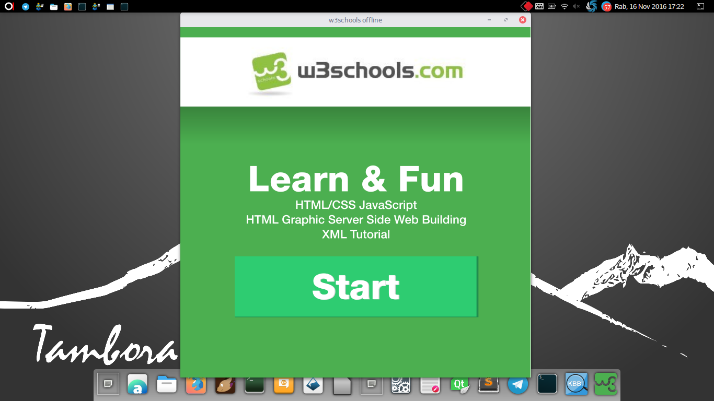

# w3schools-offline
Maleo apps

W3Schools adalah sebuah situs pengembang web, dengan tutorial dan referensi tentang bahasa pengembangan web seperti HTML, CSS, JavaScript, PHP, SQL, dan Bootstrap, yang meliputi sebagian besar aspek pemrograman web.

w3schools-offline merupakan versi luring w3school.com tersebut untuk kemudahan akses dan pembelajaran.



Untuk menjalankan w3schools-offline, pastikan bahwa Anda telah measang terlebih dahulu. Maleo dapat diunduh dan di pasang melalui github resmi BlankOn https://github.com/blankon/maleo .

Jika maleo sudah terpasang, silakan jalankan w3schools-offline dengan perintah berikut (dimisalkan anda menyimpan berkas unduhan w3school-offline pada direktori *home* Anda)
``` sh
$ maleo /home/namaanda/w3schools-offline
```
